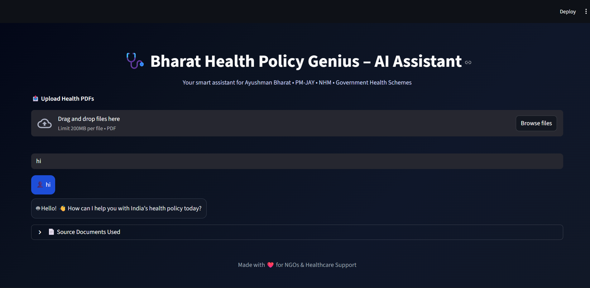

# 🩺 Bharat Health Policy Genius – AI Assistant

Bharat Health Policy Genius is an AI-powered assistant designed to help users understand India’s key health schemes such as **Ayushman Bharat**, **PM-JAY**, and **National Health Mission**.  
It uses **RAG (Retrieval-Augmented Generation)** with official government PDFs to provide accurate, reliable answers.

---

## 📸 Project Preview

---

## 🚀 Features
- 🤖 Smart AI Chat Assistant  
- 📚 Answers from Official Indian Health Policy PDFs  
- 🌐 Wikipedia & Arxiv support  
- 📤 Upload your own PDF documents  
- 🧠 Chat memory (previous chats stay)  
- ⚡ Fast & beautiful Streamlit UI  

---

## 🛠️ Tech Stack
- Python  
- Streamlit  
- LangChain  
- FAISS Vector Search  
- HuggingFace Embeddings  
- Groq LLM  
- PDF RAG  

---

## 📂 Project Structure
NGO/
├── all_docs/
│ ├── AB-PMJAY.pdf
│ ├── ayushman_bharat.pdf
│ ├── NHM_more_information.pdf
│ ├── PM-JAY.pdf
├── images/
│ ├── image.png
├── app.py
├── README.md
├── requirements.txt
├── .env

🧠 How It Works

1️⃣ Loads Indian health policy PDFs
2️⃣ Splits text + creates embeddings
3️⃣ Stores in FAISS vector DB
4️⃣ Retrieves best relevant chunks
5️⃣ AI explains answers clearly"# bharat-health-policy-ai" 
"# bharat-health-policy-ai" 
"# aryanitt-bharat-health-policy-ai" 
